# Звіт про знайдені дефекти (Bug Report) — Mini Shop

**Дата тестування:** 07–08 липня 2026 року  
**Тестувальник:** Xamidimura (Middle QA)  
**Проект:** Інтернет-магазин «Mini Shop»

## Зведена таблиця дефектів

| ID | Назва дефекту                                                                 | Пріоритет | Файл скріншоту |
| :--- |:------------------------------------------------------------------------------| :--- | :--- |
| **BUG-01** | Регістрозалежний пошук товарів у каталозі                                     | **High** | [image_2026-07-07_23-57-22.png](image_2026-07-07_23-57-22.png) |
| **BUG-02** | Можливість додавання до кошика більше товарів, ніж є в наявності              | **High** | [image_2026-07-08_00-00-15.png](image_2026-07-08_00-00-15.png) |
| **BUG-03** | Можливість багаторазового застосування одного промокоду (накопичення знижки)  | **Critical** | [image_2026-07-08_00-09-18.png](image_2026-07-08_00-09-18.png) |
| **BUG-04** | Отримання від’ємної суми кошика за рахунок промокодів при зміні товарів       | **Critical** | [image_2026-07-08_00-10-09.png](image_2026-07-08_00-10-09.png) |
| **BUG-05** | Дозволено введення нецифрових символів у полі «Телефон» під час оформлення    | **Medium** | [image_2026-07-08_00-17-12.png](image_2026-07-08_00-17-12.png) |
| **BUG-06** | Відсутність ліміту на довжину символів у полі «Телефон»                       | **Medium** | [image_2026-07-08_00-17-12 (2).png](image_2026-07-08_00-17-12%20(2).png) |
| **BUG-07** | Успішне оформлення замовлення з від'ємною загальною вартістю                  | **Critical** | [image_2026-07-08_10-08-35.png](image_2026-07-08_10-08-35.png) |
| **BUG-08** | Відсутність валідації поля «ПІБ» (дозволено переповнення та цифри/символи)    | **Medium** | [image_2026-07-08_10-10-42.png](image_2026-07-08_10-10-42.png) |
| **BUG-09** | Оформлення замовлення з невалідним форматом номера телефону                   | **Medium** | [image_2026-07-08_10-13-20.png](image_2026-07-08_10-13-20.png) |
| **BUG-10** | Несанкціонований доступ до замовлень інших користувачів через URL             | **Critical** | [image_2026-07-08_10-18-33.png](image_2026-07-08_10-18-33.png) |
| **BUG-11** | Можливість скасування замовлень інших користувачів                            | **Critical** | [image_2026-07-08_10-20-56.png](image_2026-07-08_10-20-56.png) |
| **BUG-12** | Обхід права доступу до сторінки керування товарами                            | **Critical** | [image_2026-07-08_10-28-36.png](image_2026-07-08_10-28-36.png) |
| **BUG-13** | Можливість створення/редагування товару з від’ємною ціною                     | **High** | [image_2026-07-08_10-32-06.png](image_2026-07-08_10-32-06.png) |
| **BUG-14** | Можливість додавання до кошика товару, якого немає в наявності                | **High** | [image_2026-07-08_10-34-40.png](image_2026-07-08_10-34-40.png), [image_2026-07-08_10-34-40 (2).png](image_2026-07-08_10-34-40%20(2).png) |
| **BUG-15** | Підсумкова ціна кошика не перераховується при зміні кількості товарів         | **High** | [image_2026-07-08_10-36-16.png](image_2026-07-08_10-36-16.png) |
| **BUG-16** | Некоректна поведінка каталогу при переході на неіснуючі сторінки пагінації    | **Low** | [image_2026-07-08_10-37-41.png](image_2026-07-08_10-37-41.png) |
| **BUG-17** | Можливість створення користувача з ім'ям, що переповнює інтерфейс             | **Medium** | [image_2026-07-08_10-50-16.png](image_2026-07-08_10-50-16.png) |
| **BUG-18** | Збережена HTML-ін'єкція у відгуках                                            | **Critical** | [image_2026-07-08_12-18-39.png](image_2026-07-08_12-18-39.png) |

---

## Детальний опис дефектів

### BUG-01: Регістрозалежний пошук товарів у каталозі
> [!NOTE]
> Дефект впливає на зручність пошуку. Користувачі часто вписують назви товарів дрібними літерами, тому очікують релевантну видачу незалежно від регістру.
*   **Пріоритет:** **High**
*   **Опис:** При введенні пошукового запиту в каталозі система вимагає точного збігу регістру літер. Пошук слова "настільна" (з маленької літери) не знаходить товар "Настільна LED-лампа".
*   **Кроки відтворення:**
1. Відкрити головну сторінку каталогу.
2. У полі "Пошук за назвою..." ввести запит `настільна` (у нижньому регістрі).
3. Натиснути кнопку "Знайти".
*   **Очікуваний результат:** У результатах пошуку відображається товар "Настільна LED-лампа".
*   **Фактичний результат:** Відображається напис "Товарів не знайдено."
*   **Скріншот:**

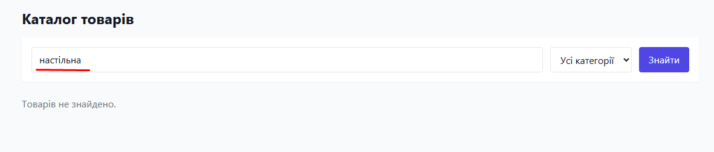

---

### BUG-02: Можливість додавання до кошика більше товарів, ніж є в наявності
> [!WARNING]
> Даний дефект веде до проблем із логістикою та продажу неіснуючих залишків товарів на складі.
*   **Пріоритет:** **High**
*   **Опис:** На сторінці деталей товару користувач може ввести будь-яку кількість товару в поле "Кількість" (навіть якщо вона перевищує залишок на складі) та успішно додати його до кошика.
*   **Кроки відтворення:**
1. Перейти на сторінку товару "Настільна LED-лампа" (доступно: 20 шт.).
2. У полі "Кількість" ввести `21` (або будь-яке число більше 20).
3. Натиснути кнопку "Додати в кошик".
*   **Очікуваний результат:** Система видає помилку або автоматично обмежує кількість до максимального залишку (20 шт.).
*   **Фактичний результат:** Товар додається у кількості 21 шт.
*   **Скріншот:**

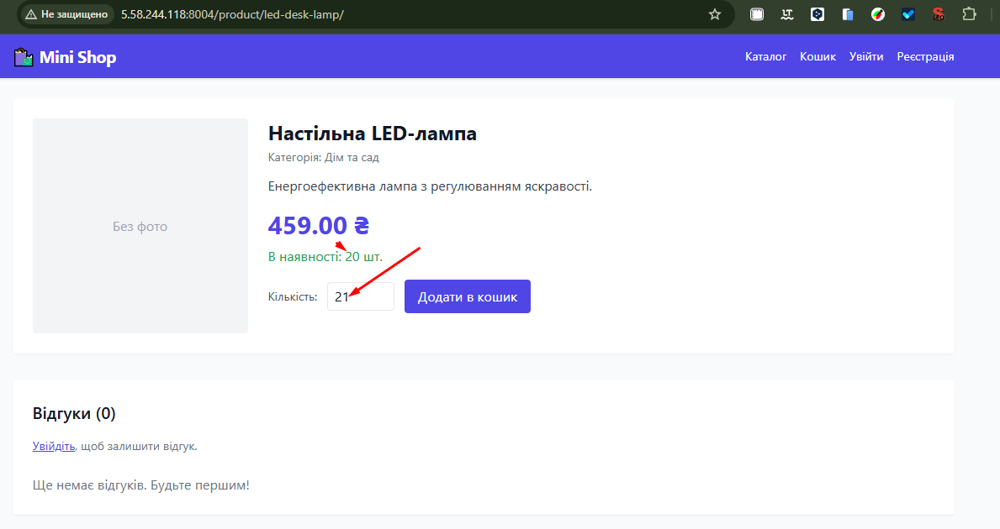

---

### BUG-03: Можливість багаторазового застосування одного промокоду (накопичення знижки)
> [!CAUTION]
> Фінансова вразливість, яка дозволяє отримати товари безкоштовно або з величезними несанкціонованими знижками.
*   **Пріоритет:** **Critical**
*   **Опис:** Користувач може застосовувати промокод `SALE10` кілька разів поспіль на один і той самий кошик, накопичуючи знижку (наприклад, 20%, 30% і більше).
*   **Кроки відтворення:**
1. Авторизуватися під будь-яким акаунтом і додати будь-який товар до кошика.
2. Перейти до кошика.
3. У полі "Промокод" ввести `SALE10` та натиснути "Застосувати" (знижка стає 10%).
4. Повторно ввести `SALE10` у це ж поле та натиснути "Застосувати".
*   **Очікуваний результат:** Система повинна заблокувати повторне застосування промокоду з помилкою "Промокод вже застосовано".
*   **Фактичний результат:** Промокод застосовується вдруге, знижка збільшується до 20%.
*   **Скріншот:**

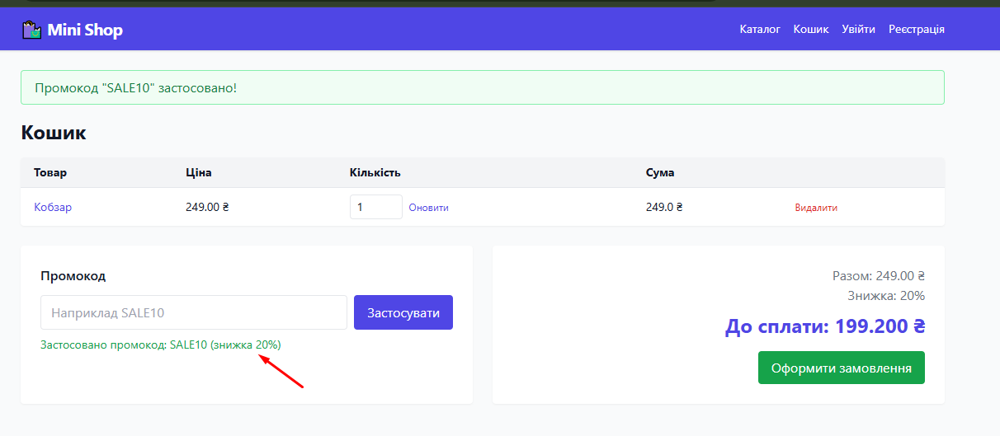

---

### BUG-04: Отримання від’ємної суми кошика за рахунок промокодів при зміні товарів
> [!CAUTION]
> Критична бізнес-логіка порушена. Дозволяє отримати від'ємну суму до сплати.
*   **Пріоритет:** **Critical**
*   **Опис:** Якщо застосувати купон багаторазово (накопичивши знижку понад 100%, наприклад 110%), сума замовлення стає від'ємною.
*   **Кроки відтворення:**
1. Додати товар до кошика (наприклад, "Кобзар", 249 ₴).
2. Застосувати промокод `SALE10` 11 разів поспіль.
*   **Очікуваний результат:** Відсоток знижки не може перевищувати встановлений ліміт (макс. 10% для цього коду) і сума до сплати не може бути меншою за 0.
*   **Фактичний результат:** Знижка стає 110%, сума до сплати стає `-24.900 ₴`.
*   **Скріншот:**

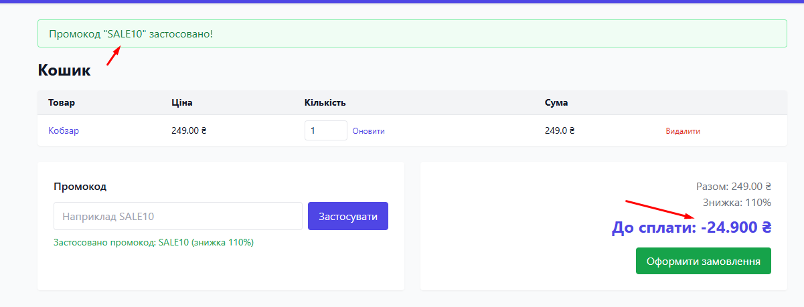

---

### BUG-05: Дозволено введення нецифрових символів у полі «Телефон» під час оформлення
*   **Пріоритет:** **Medium**
*   **Опис:** Поле введення телефону під час оформлення замовлення не має валідації на типи символів. Воно дозволяє вводити букви, розділові знаки та спецсимволи.
*   **Кроки відтворення:**
1. Додати товар до кошика, перейти до оформлення.
2. У полі "Телефон" ввести текст із літерами та спецсимволами, наприклад: `---;sed@#099) 111 11`.
3. Натиснути "Підтвердити замовлення".
*   **Очікуваний результат:** Поле телефону має приймати лише цифри та знаки `+`, `(`, `)`, `-` (або валідувати формат).
*   **Фактичний результат:** Введені нецифрові символи приймаються системою без помилок.
*   **Скріншот:**

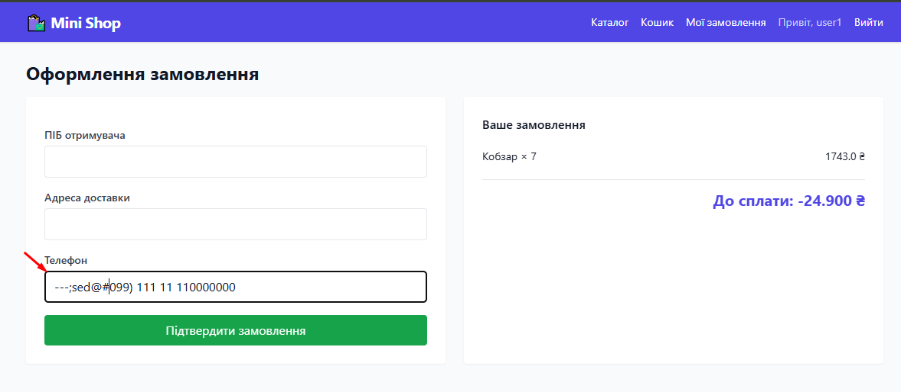

---

### BUG-06: Відсутність ліміту на довжину символів у полі «Телефон»
*   **Пріоритет:** **Medium**
*   **Опис:** Поле "Телефон" не обмежує кількість введених символів, що дозволяє ввести довгий рядок, який потім відображається некоректно.
*   **Кроки відтворення:**
1. На сторінці оформлення замовлення у полі "Телефон" ввести дуже довгий рядок цифр чи символів (понад 20 символів).
2. Оформити замовлення.
*   **Очікуваний результат:** Максимальна довжина поля обмежена стандартним форматом телефону (наприклад, до 15 символів).
*   **Фактичний результат:** Рядок будь-якої довжини приймається та зберігається.
*   **Скріншот:**

.png)

---

### BUG-07: Успішне оформлення замовлення з від'ємною загальною вартістю
> [!CAUTION]
> Серйозна фінансова та логічна дірка. Користувач може розмістити безкоштовне замовлення і вимагати повернення коштів.
*   **Пріоритет:** **Critical**
*   **Опис:** Система дозволяє завершити процес оформлення замовлення з від'ємним підсумком до сплати. Таке замовлення успішно створюється в базі даних та відображається в історії замовлень.
*   **Кроки відтворення:**
1. Сформувати кошик із від'ємною сумою (див. BUG-05).
2. Заповнити обов'язкові поля оформлення замовлення (ПІБ, адреса, телефон).
3. Натиснути кнопку "Підтвердити замовлення".
*   **Очікуваний результат:** Система блокує створення замовлення, якщо сума до сплати є некоректною (<= 0).
*   **Фактичний результат:** Відображається повідомлення "Замовлення успішно оформлено!", створюється замовлення з сумою `-24.90 ₴`.
*   **Скріншот:**

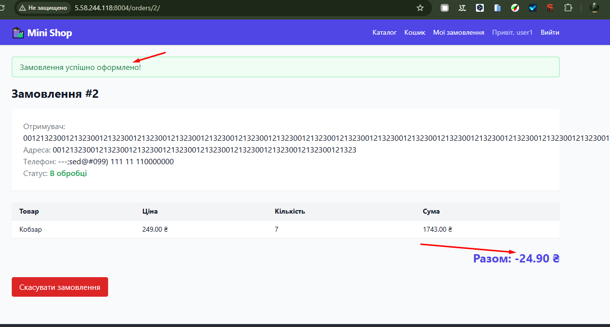

---

### BUG-08: Відсутність валідації поля «ПІБ» (дозволено переповнення та цифри/символи)
*   **Пріоритет:** **Medium**
*   **Опис:** Поле "ПІБ отримувача" при оформленні замовлення не валідується на тип даних (дозволяє вводити тільки цифри) та не має ліміту довжини (дозволяє переповнення текстового блоку).
*   **Кроки відтворення:**
1. При оформленні замовлення в полі "ПІБ отримувача" ввести довгий рядок цифр: `0012132300121323001213230012132300121323...`.
2. Натиснути кнопку "Підтвердити замовлення".
*   **Очікуваний результат:** Поле приймає лише літери та обмежує довжину імені розумними рамками (наприклад, до 100 символів), видаючи помилку валідації при некоректному вводі.
*   **Фактичний результат:** Замовлення успішно створюється з невалідним іменем, яке виходить за межі блоку в деталях замовлення.
*   **Скріншот:**

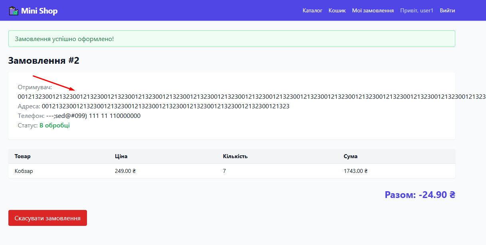

---

### BUG-09: Оформлення замовлення з невалідним форматом номера телефону
*   **Пріоритет:** **Medium**
*   **Опис:** Відсутній маскований ввід або перевірка формату номера телефону перед відправкою форми. Замовлення створюється з абсолютно хаотичним набором символів замість номера.
*   **Кроки відтворення:**
1. Заповнити форму оформлення замовлення, вказавши у полі телефон невалідний рядок (наприклад, `---;sed@#099) 111 11 110000000`).
2. Надіслати форму.
*   **Очікуваний результат:** Форма повертає помилку: "Введіть коректний номер телефону".
*   **Фактичний результат:** Замовлення створюється та зберігається з невалідним номером.
*   **Скріншот:**

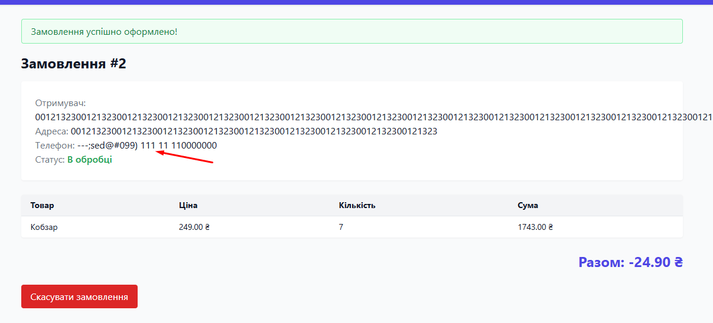

---

### BUG-10: Несанкціонований доступ до замовлень інших користувачів через URL (IDOR)
> [!CAUTION]
> Критична вразливість витоку персональних даних клієнтів (GDPR violation).
*   **Пріоритет:** **Critical**
*   **Опис:** Користувач може переглядати деталі замовлень інших покупців, просто підставивши інший ID замовлення в URL-адресу (наприклад, `/orders/1/` замість `/orders/2/`). Перевірка власника замовлення на сервері відсутня.
*   **Кроки відтворення:**
1. Авторизуватися як користувач `user2`.
2. У браузері ввести пряму адресу замовлення користувача `user1` (наприклад, `http://5.58.244.118:8004/orders/1/`).
*   **Очікуваний результат:** Помилка доступу "403 Forbidden" або перенаправлення на власну сторінку замовлень.
*   **Фактичний результат:** Відкривається повна інформація про замовлення #1 іншого користувача (ПІБ, адреса доставки, список товарів, сума).
*   **Скріншот:**

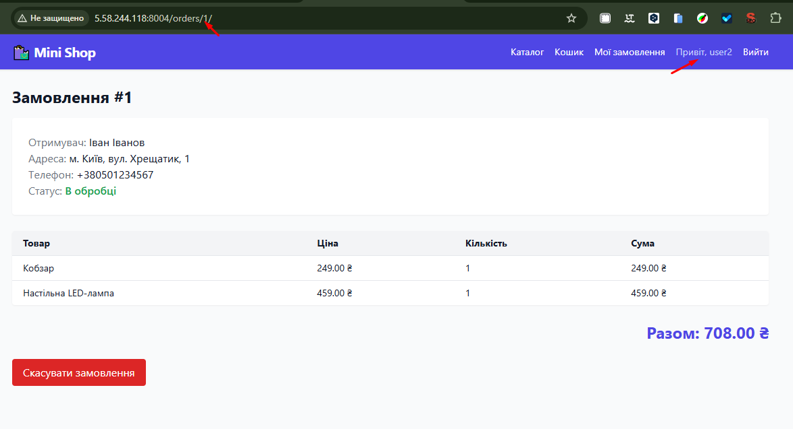

---

### BUG-11: Можливість скасування замовлень інших користувачів (IDOR/Broken Access Control)
> [!CAUTION]
> Дає змогу зловмиснику скасувати всі замовлення в інтернет-магазині.
*   **Пріоритет:** **Critical**
*   **Опис:** Користувач може не тільки переглядати чужі замовлення через URL-маніпуляцію (BUG-11), але й успішно скасовувати їх, натиснувши кнопку "Скасувати замовлення" на чужій сторінці.
*   **Кроки відтворення:**
1. Авторизуватися як `user2`.
2. Перейти на сторінку чужого замовлення `http://5.58.244.118:8004/orders/1/`.
3. Натиснути кнопку "Скасувати замовлення".
*   **Очікуваний результат:** Кнопка скасування відсутня на сторінці чужого замовлення, а спроба надіслати запит на скасування повертає помилку авторизації.
*   **Фактичний результат:** Замовлення скасовується, з'являється статусне повідомлення "Замовлення #1 скасовано."
*   **Скріншот:**

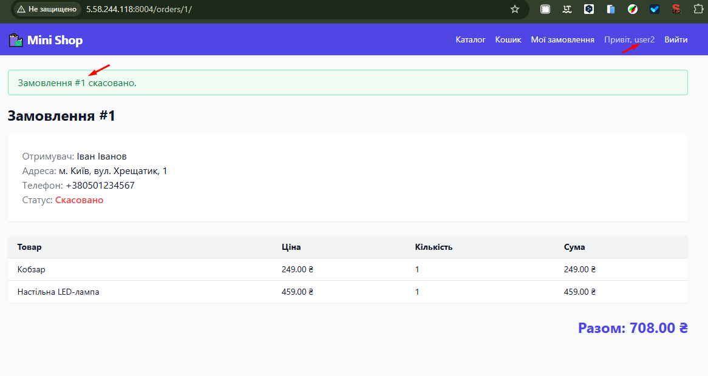

---

### BUG-12: Обхід права доступу до сторінки керування товарами (Broken Access Control)
> [!CAUTION]
> Повний компромат системи управління каталогом. Звичайний користувач отримує права контент-менеджера/адміністратора.
*   **Пріоритет:** **Critical**
*   **Опис:** Будь-який авторизований користувач, який не є адміністратором (наприклад, `user1`), може отримати повний доступ до адмін-сторінки керування товарами, ввівши пряме посилання в URL.
*   **Кроки відтворення:**
1. Авторизуватися під звичайним акаунтом `user1`.
2. Ввести в адресному рядку пряме посилання: `http://5.58.244.118:8004/manage/products/`.
*   **Очікуваний результат:** Доступ заборонено (помилка 403 Forbidden або редирект на головну сторінку).
*   **Фактичний результат:** Користувач отримує повний доступ до сторінки "Керування товарами" з можливістю додавання, редагування та видалення товарів.
*   **Скріншот:**

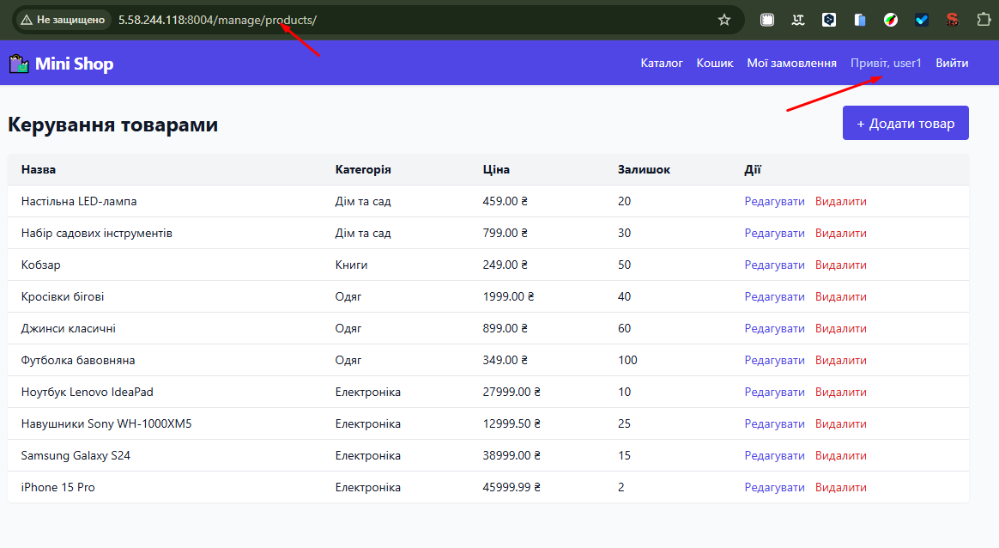

---

### BUG-13: Можливість створення/редагування товару з від’ємною ціною
*   **Пріоритет:** **High**
*   **Опис:** На сторінці керування товарами при створенні або редагуванні товару поле "Price" (Ціна) не має валідації на мінімальне значення (> 0). Система дозволяє зберегти товар з ціною `-1,08 ₴`.
*   **Кроки відтворення:**
1. Зайти на сторінку редагування товару (або створення нового).
2. У полі "Price" ввести від'ємне значення (наприклад, `-1,08`).
3. Натиснути кнопку збереження/створення.
*   **Очікуваний результат:** Система видає помилку валідації "Ціна не може бути меншою за 0".
*   **Фактичний результат:** Товар успішно зберігається з ціною `-1,08 ₴`.
*   **Скріншот:**

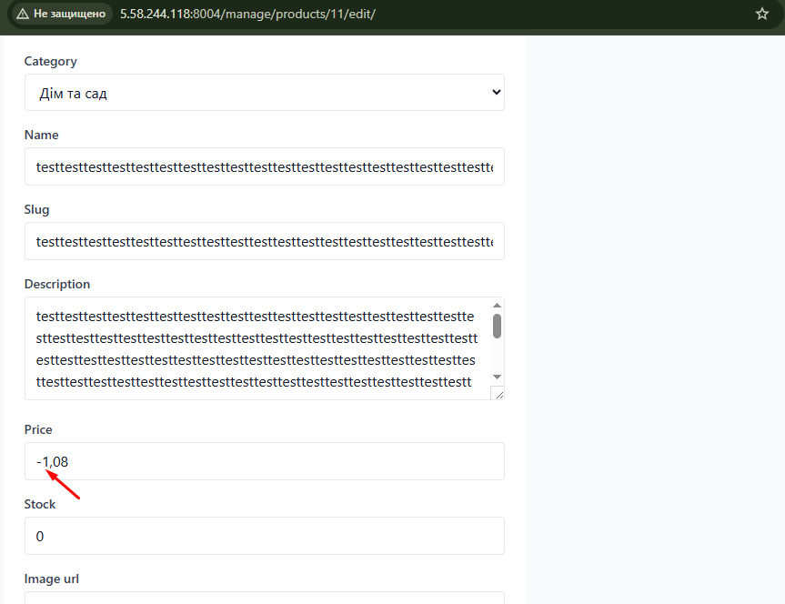

---

### BUG-14: Можливість додавання до кошика товару, якого немає в наявності
*   **Пріоритет:** **High**
*   **Опис:** Якщо товар має статус "Немає в наявності", кнопка "Додати в кошик" все одно залишається активною на сторінці деталей товару, і користувач може купувати відсутній товар.
*   **Кроки відтворення:**
1. Відкрити сторінку товару, залишок якого дорівнює 0 (статус "Немає в наявності").
2. Натиснути кнопку "Додати в кошик".
3. Перейти в кошик.
*   **Очікуваний результат:** Кнопка "Додати в кошик" неактивна (disabled) для товарів із нульовим залишком, додавання заблоковано.
*   **Фактичний результат:** Товар успішно додається до кошика, створюючи потенційну проблему з поставками.
*   **Скріншоти:**

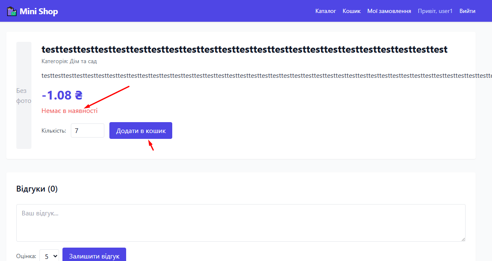

.png)

---

### BUG-15: Підсумкова ціна кошика не перераховується при зміні кількості товарів
*   **Пріоритет:** **High**
*   **Опис:** При зміні кількості товару безпосередньо у кошику (наприклад, встановлено 4 шт. замість 1), сума за конкретний рядок товару перераховується правильно, але загальний підсумок кошика ("Разом" та "До сплати") залишається незмінним — розраховується за формулою базової ціни за 1 одиницю кожного товару.
*   **Кроки відтворення:**
1. Додати в кошик два товари (наприклад, "Набір садових інструментів" — 799 ₴ та "Настільна LED-лампа" — 459 ₴).
2. У кошику змінити кількість "Набір садових інструментів" на 4. Натиснути "Оновити".
3. Перевірити загальну суму.
*   **Очікуваний результат:** Рядок товару показує `3196 ₴`. Загальна сума стає `3196 + 459 = 3655 ₴`.
*   **Фактичний результат:** Рядок показує `3196 ₴`, але підсумкове поле "Разом" показує `1258 ₴` (799 + 459).
*   **Скріншот:**

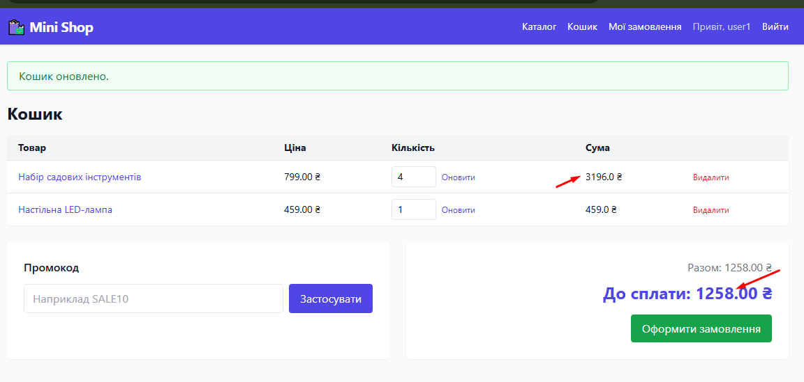

---

### BUG-16: Некоректна поведінка каталогу при переході на неіснуючі сторінки пагінації
*   **Пріоритет:** **Low**
*   **Опис:** Система не обробляє перехід за прямим посиланням на неіснуючу сторінку пагінації (наприклад, `?page=4`, коли товарів всього на 3 сторінки). Замість редиректу на першу сторінку або показу повідомлення "Сторінки не існує", відображається пустий каталог.
*   **Кроки відтворення:**
1. У каталозі товарів змінити параметр в URL на неіснуючу сторінку, наприклад: `http://5.58.244.118:8004/?page=4`.
2. Перейти за цим посиланням.
*   **Очікуваний результат:** Система перенаправляє на діючу сторінку (наприклад, `?page=1`) або виводить валідне повідомлення про відсутність такої сторінки.
*   **Фактичний результат:** Відображається пустий каталог з повідомленням "Товарів не знайдено."
*   **Скріншот:**

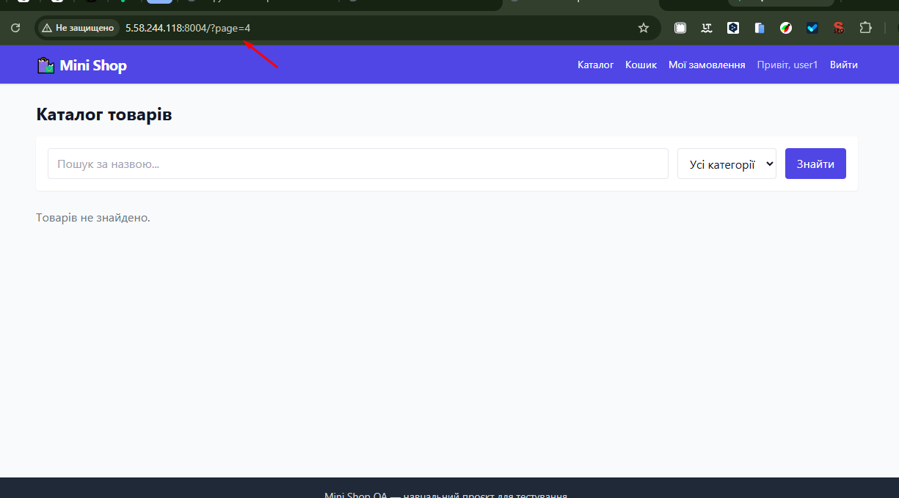

---

### BUG-17: Можливість створення користувача з ім'ям, що переповнює інтерфейс
*   **Пріоритет:** **Medium**
*   **Опис:** При реєстрації нового користувача поле "Username" не обмежує довжину тексту. Це дозволяє зареєструвати користувача з дуже довгим ім'ям, яке ламає відображення панелі привітання в шапці сайту після авторизації.
*   **Кроки відтворення:**
1. Відкрити сторінку реєстрації.
2. У полі Username ввести довгу комбінацію символів (наприклад, 60+ символів).
3. Заповнити паролі та завершити реєстрацію.
4. Авторизуватися під цим акаунтом.
*   **Очікуваний результат:** Валідація обмежує довжину імені користувача (наприклад, до 30 символів).
*   **Фактичний результат:** Акаунт успішно реєструється, а довге ім'я вилазить за межі шапки сайту ("Привіт, user3333333333333...").
*   **Скріншот:**

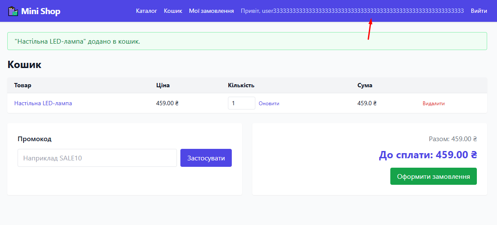

---

### BUG-18: Збережена HTML-ін'єкція
*   **Пріоритет:** **Critical**
*   **Опис:** Форма надсилання відгуків до товарів не екранує введені користувачем дані перед збереженням та виводом на сторінці.
*   **Кроки відтворення:**
1. Авторизуватися на сайті під будь-яким акаунтом.
2. Перейти на сторінку товару (наприклад, `/product/led-desk-lamp/`).
3. У полі "Ваш відгук..." ввести текст: `<b>"Тест HTML"</b> `.
4. Натиснути кнопку "Залишити відгук".
5. Оновити сторінку.
*   **Очікуваний результат:** Текст відображається безпечно, теги відображаються як звичайний текст (екрановані).
*   **Фактичний результат:** Теги відпрацьовують як HTML, а JS-код запускається у браузері користувача.
*   **Скріншот:**

    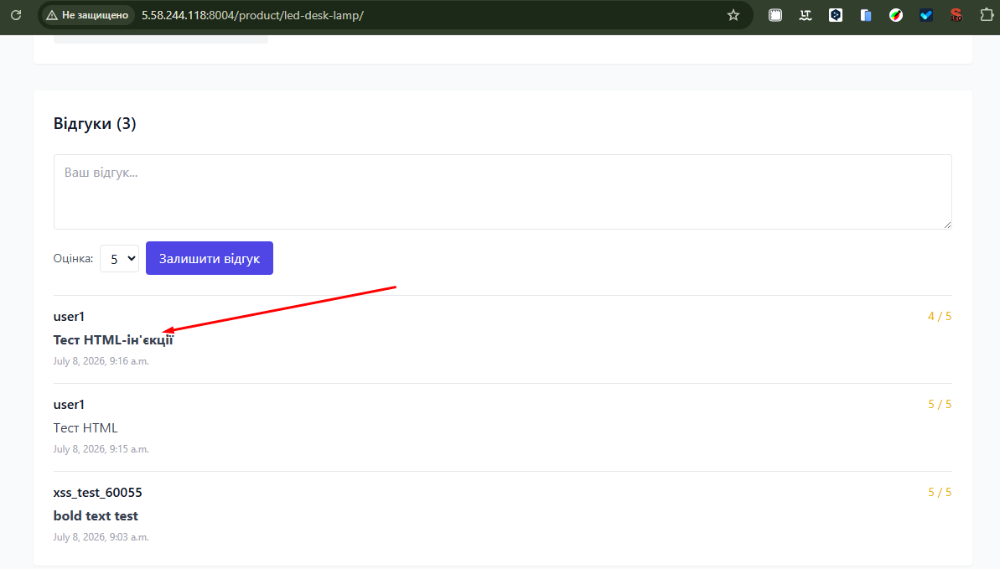

## Нотатки та рекомендації

### 1. Відсутність поля «Електронна адреса» (Email) на сторінці реєстрації
*   **Опис:** Форма реєстрації нового користувача містить поля лише для Username та Password, хоча в системі адміністрування (Django admin) сутність користувача має обов'язкове поле "Email address", яке залишається незаповненим (або заповнюється дефолтним плейсхолдером). Оскільки вимог щодо обов'язковості цього поля на клієнтській частині не було надано, це винесено як рекомендацію для покращення UX та бізнес-логіки.
*   **Кроки відтворення:**
1. Відкрити форму реєстрації нового користувача.
2. Звернути увагу на перелік доступних полів.
*   **Очікуваний результат:** На формі присутнє поле для введення електронної пошти з обов'язковою валідацією на символ `@`.
*   **Фактичний результат:** Поле Email відсутнє на клієнтській формі реєстрації.
*   **Скріншоти:**

    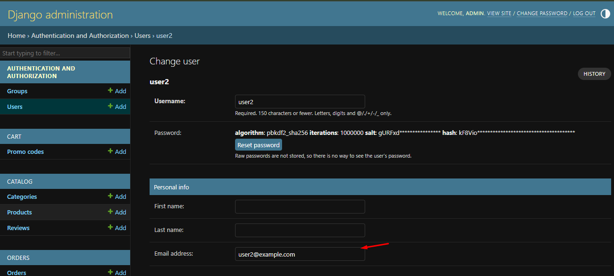

    .png)
